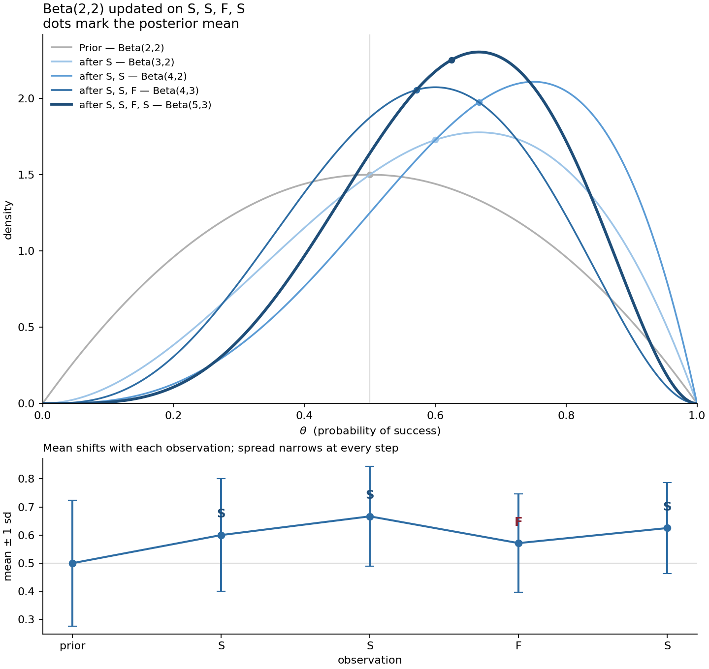

# 02 · Conjugate priors

**Source:** Bayesian Series Part 1 §5, §7
**Implements:** `core/distributions.py` — `Beta`, `Gaussian`, `Dirichlet`

A prior is conjugate to a likelihood when the posterior falls in the same family as
the prior. Updating then reduces to arithmetic on parameters: no integral, no
sampling. The mechanism is the same in every case — write prior × likelihood, discard
everything that does not contain the parameter, and recognise the kernel that remains.

| Likelihood | Conjugate prior | Posterior update |
| --- | --- | --- |
| Bernoulli / Binomial | Beta | add successes and failures to $\alpha, \beta$ |
| Categorical / Multinomial | Dirichlet | add counts to $\boldsymbol\alpha$ |
| Gaussian (known variance) | Gaussian | precision-weighted mean blend |
| Poisson | Gamma | add counts and exposure |

---

## 1 · Beta–Bernoulli

**Handwritten working:** [scans/02-conjugate-priors-beta.pdf](scans/02-conjugate-priors-beta.pdf)

### Result

$$\text{Beta}(\alpha, \beta) \;\xrightarrow{\;s \text{ successes in } n \text{ trials}\;}\; \text{Beta}(\alpha + s,\; \beta + n - s)$$

### Derivation

**The Beta kernel.** The Beta density is

$$p(\theta) = \frac{\theta^{\alpha-1}(1-\theta)^{\beta-1}}{B(\alpha, \beta)}, \qquad \theta \in [0,1]$$

The Beta function $B(\alpha,\beta)$ depends on the parameters but not on $\theta$, so it
is constant in the quantity being inferred and is dropped:

$$p(\theta) \;\propto\; \theta^{\alpha-1}(1-\theta)^{\beta-1}$$

Note the exponents are $\alpha-1$ and $\beta-1$, not $\alpha$ and $\beta$. That offset is
what makes the update come out as plain addition.

**The likelihood.** A single Bernoulli observation with $\theta$ the probability of
success gives $p(x=1 \mid \theta) = \theta$ and $p(x=0 \mid \theta) = 1-\theta$, which
combine into one expression using the exponent as a switch:

$$p(x \mid \theta) = \theta^{x}(1-\theta)^{1-x}$$

For $n$ independent observations the product collapses, because the exponents simply sum:

$$p(D \mid \theta) = \prod_{i=1}^{n}\theta^{x_i}(1-\theta)^{1-x_i} = \theta^{s}(1-\theta)^{n-s}$$

with $s = \sum x_i$. The data enters only through $s$ and $n$ — the *order* of the
observations has vanished.

**Multiply and match.**

$$p(\theta \mid D) \;\propto\; p(D \mid \theta)\,p(\theta)
= \theta^{s}(1-\theta)^{n-s} \cdot \theta^{\alpha-1}(1-\theta)^{\beta-1}$$

Powers of the same base add:

$$= \theta^{\alpha + s - 1}\,(1-\theta)^{\beta + n - s - 1}$$

This is the kernel of a Beta with parameters $\alpha + s$ and $\beta + n - s$. A density
is determined by its kernel, so the posterior is $\text{Beta}(\alpha+s,\; \beta+n-s)$ —
read off, with no integration performed.

### Worked sequence

Starting from $\text{Beta}(2,2)$ — a mild prior centred at $0.5$ — and observing
S, S, F, S:

$$\mathbb{E}[\theta] = \frac{\alpha}{\alpha+\beta},
\qquad
\operatorname{Var}[\theta] = \frac{\alpha\beta}{(\alpha+\beta)^2(\alpha+\beta+1)}$$

| Step | | $\alpha+\beta$ | Mean | Mode | Variance | SD |
| --- | --- | --- | --- | --- | --- | --- |
| Prior | Beta(2,2) | 4 | 0.500 | 0.500 | 0.0500 | 0.224 |
| S | Beta(3,2) | 5 | 0.600 | 0.667 | 0.0400 | 0.200 |
| S | Beta(4,2) | 6 | 0.667 | 0.750 | 0.0317 | 0.178 |
| F | Beta(4,3) | 7 | 0.571 | 0.600 | 0.0306 | 0.175 |
| S | Beta(5,3) | 8 | 0.625 | 0.667 | 0.0260 | 0.161 |

Three things the sequence shows:

**The variance falls at every step, including the failure.** Each observation adds one
to $\alpha+\beta$ regardless of outcome, and $\alpha+\beta$ is what controls the width.
A failure pulls the mean down while still narrowing the distribution — evidence is
evidence whichever way it points.

**The mode moves faster than the mean.** After two successes the peak sits at $0.75$
but the mean at $0.667$, because the mean is dragged back toward $0.5$ by the prior's
mass. That gap is exactly the difference between a MAP plug-in and the posterior
predictive (section 4).

**The sharpening is modest.** SD falls only from $0.224$ to $0.161$ across four
observations — the effective sample size went from 4 to 8. With this little data,
treating $\theta$ as known would be a real error.

### Why it matters

The prior parameters behave as **pseudo-counts**: imagined observations already seen.
Because the kernel exponent is $\alpha-1$, a $\text{Beta}(2,2)$ prior contributes one
imagined success and one imagined failure — which is the precise sense in which it is
"mild", and why $\alpha+\beta$ reads as an effective sample size.

Belief as an accumulating tally is the most useful single picture of Bayesian learning,
and it makes the Dirichlet generalisation (section 5) a restatement rather than a new
idea.

### Checks

- $\text{Beta}(2,2)$ after S,S,F,S equals $\text{Beta}(5,3)$ exactly
- hand-computed posteriors match `get_posterior_distribution_params` on `[1,1,0,1]`
- the variance is strictly decreasing across the sequence
- $0 \le \operatorname{Var}[\theta] \le 0.25$ always — a Beta lives on $[0,1]$, so a
  variance outside that range is impossible and makes a cheap assertion

---

## 2 · Sequential updating equals batch updating

_To do._

---

## 3 · Gaussian–Gaussian

**Handwritten working:** [scans/02-conjugate-priors-gaussian.pdf](scans/02-conjugate-priors-gaussian.pdf)

### Result

With known observation variance $\sigma^2$, a Gaussian prior $\mathcal{N}(\mu_0, \sigma_0^2)$
on the mean, and one observation $x$:

$$\frac{1}{\sigma^2_{\text{post}}} = \frac{1}{\sigma_0^2} + \frac{1}{\sigma^2},
\qquad
\mu_{\text{post}} = \frac{\dfrac{\mu_0}{\sigma_0^2} + \dfrac{x}{\sigma^2}}{\dfrac{1}{\sigma_0^2} + \dfrac{1}{\sigma^2}}$$

Equivalently, clearing the fractions:

$$\sigma^2_{\text{post}} = \frac{\sigma_0^2\sigma^2}{\sigma_0^2 + \sigma^2},
\qquad
\mu_{\text{post}} = \frac{\sigma^2\mu_0 + \sigma_0^2 x}{\sigma^2 + \sigma_0^2}$$

**Precisions add. The mean is the precision-weighted blend.**

### Derivation

**Setup.** Prior $\theta \sim \mathcal{N}(\mu_0, \sigma_0^2)$; likelihood
$x \mid \theta \sim \mathcal{N}(\theta, \sigma^2)$ with $\sigma^2$ known.

From Bayes' theorem,

$$p(\theta \mid x) = \frac{p(x \mid \theta)\,p(\theta)}{p(x)}$$

The denominator contains no $\theta$, so it is constant in the quantity being inferred
and can be recovered later by normalising:

$$p(\theta \mid x) \propto \exp\left(-\left[\frac{(x-\theta)^2}{2\sigma^2} + \frac{(\theta-\mu_0)^2}{2\sigma_0^2}\right]\right)$$

Both $1/\sqrt{2\pi\sigma^2}$ prefactors are likewise constant in $\theta$ and are
dropped at the same step.

**Substitute precisions** $\tau = 1/\sigma^2$, $\tau_0 = 1/\sigma_0^2$, and factor out
$-\tfrac{1}{2}$:

$$\propto \exp\left(-\tfrac{1}{2}\left[\tau(x-\theta)^2 + \tau_0(\theta-\mu_0)^2\right]\right)$$

**Expand both squares:**

$$\tau x^2 + \tau\theta^2 - 2\tau\theta x + \tau_0\theta^2 + \tau_0\mu_0^2 - 2\tau_0\theta\mu_0$$

**Collect in powers of $\theta$**, gathering the $\theta^0$ terms into $C = \tau x^2 + \tau_0\mu_0^2$:

$$(\tau + \tau_0)\theta^2 - 2(\tau x + \tau_0\mu_0)\theta + C$$

**Factor out the $\theta^2$ coefficient.** Let $\tau_{\text{post}} = \tau + \tau_0$ and
$m = \dfrac{\tau_0\mu_0 + \tau x}{\tau_0 + \tau}$:

$$= \tau_{\text{post}}\left[\theta^2 - 2m\theta\right] + C$$

**Complete the square**, using $\theta^2 - 2m\theta = (\theta - m)^2 - m^2$:

$$= \tau_{\text{post}}\left[(\theta - m)^2 - m^2\right] + C$$

Distributing $\tau_{\text{post}}$:

$$= \tau_{\text{post}}(\theta - m)^2 - \tau_{\text{post}}m^2 + C$$

The final two terms contain no $\theta$, so both are absorbed into the normalising
constant, leaving

$$p(\theta \mid x) \propto \exp\left(-\tfrac{1}{2}\,\tau_{\text{post}}(\theta - m)^2\right)$$

**Match the kernel.** A Gaussian $\mathcal{N}(\mu_{\text{post}}, \sigma^2_{\text{post}})$ has kernel

$$\exp\left(-\frac{(\theta - \mu_{\text{post}})^2}{2\sigma^2_{\text{post}}}\right)$$

A density is determined by its kernel, so comparing term by term:

$$\mu_{\text{post}} = m = \frac{\tau_0\mu_0 + \tau x}{\tau_0 + \tau},
\qquad
\sigma^2_{\text{post}} = \frac{1}{\tau_{\text{post}}}$$

Substituting $\tau = 1/\sigma^2$ and $\tau_0 = 1/\sigma_0^2$ gives the stated results.

### Limiting behaviour

As the prior variance $\sigma_0^2 \to \infty$ (equivalently $\tau_0 \to 0$):

$$\mu_{\text{post}} = \frac{\tau_0\mu_0 + \tau x}{\tau_0 + \tau} \;\longrightarrow\; \frac{\tau x}{\tau} = x$$

An uninformative prior contributes no precision, so the posterior mean is the
observation alone — the prior stops mattering. Symmetrically, as $\sigma^2 \to \infty$
the observation is uninformative and $\mu_{\text{post}} \to \mu_0$.

Note also that $\tau_{\text{post}} = \tau_0 + \tau$ is always greater than either input
precision: **observing something can never make you less certain.**

### Why it matters

Applied recursively — with a state transition applied between successive observations
— this update *is* the Kalman filter measurement step. Stage 3 introduces no new
inferential idea there; it repeats this one in a loop.

The reason conjugacy works at all is the subject of
[note 03](03-exponential-family.md): the Gaussian's natural parameters are
$\eta_1 = \mu/\sigma^2$ and $\eta_2 = -1/(2\sigma^2)$, and combining two Gaussians adds
them. Since $\eta_2$ is a negative half-precision, *adding natural parameters is
adding precisions*. This note shows that the update works; note 03 shows why it had to.

### Checks

- closed form matches a brute-force numerical posterior on a grid, to 5 d.p., across
  asymmetric cases — verified
- $\mu_0 = 0$, $\sigma_0^2 = 1$, $x = 2$, $\sigma^2 = 1$ gives $\mu_{\text{post}} = 1$,
  $\sigma^2_{\text{post}} = 0.5$ — equal precisions, so the mean sits exactly halfway
- reducing $\sigma^2$ (a sharper observation) moves $\mu_{\text{post}}$ toward $x$
- $\sigma^2_{\text{post}} < \min(\sigma_0^2, \sigma^2)$ always
- sequential updating on two observations equals a single batch update

---

## 4 · Posterior predictive

_To do._

---

## 5 · Dirichlet–Categorical

_To do._